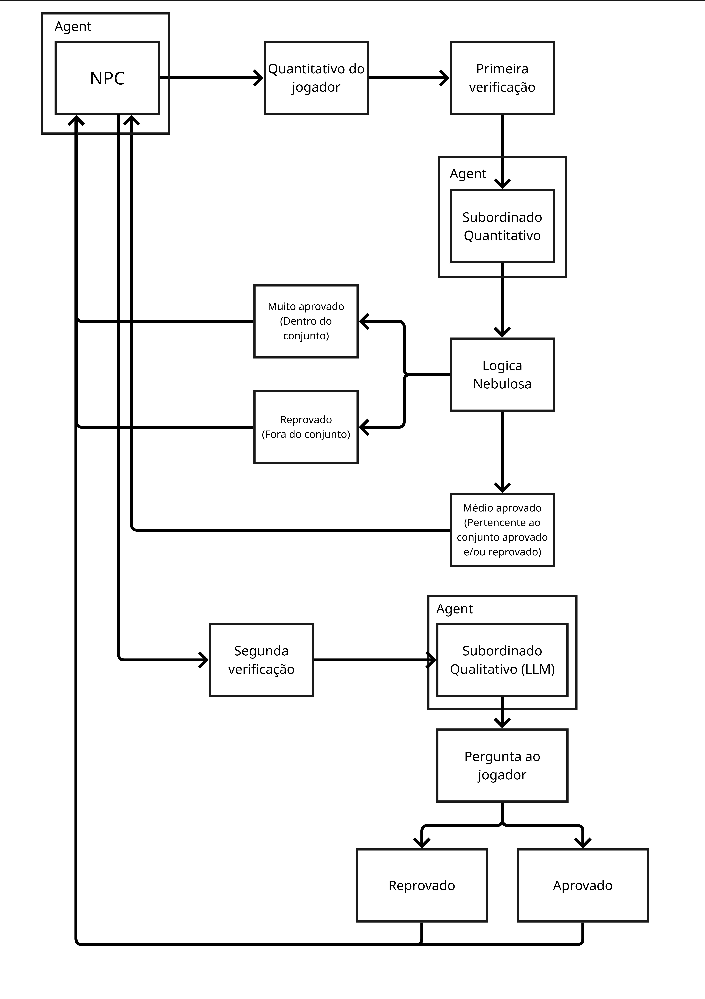
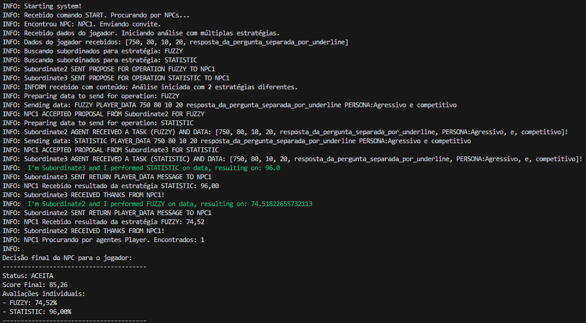
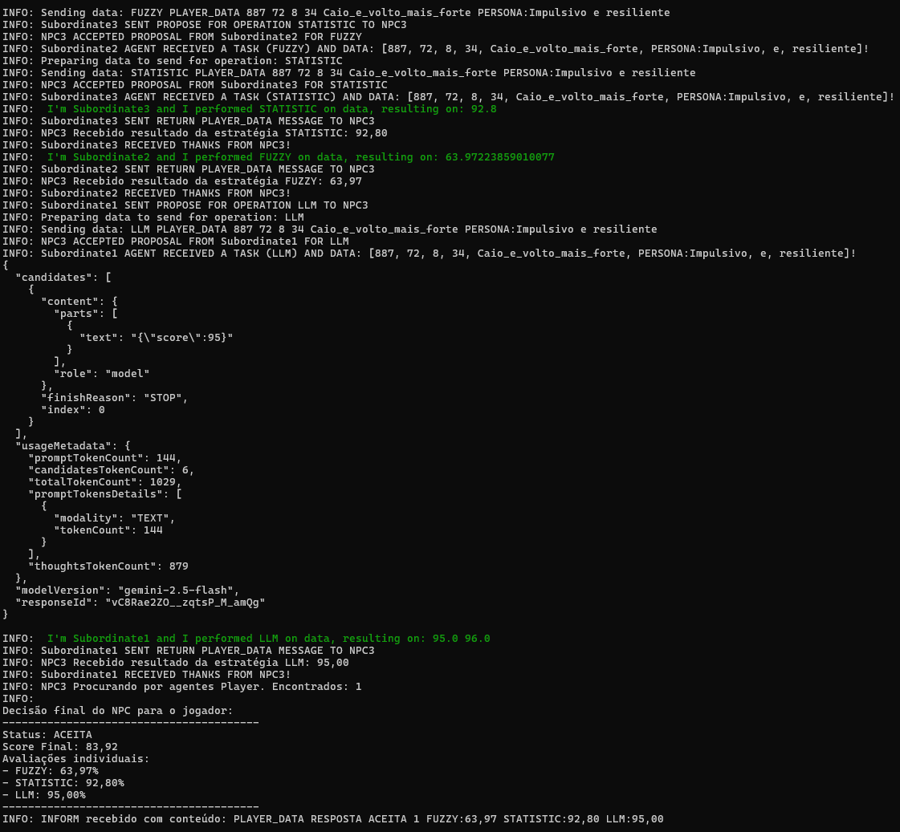

# Como NPCs podem aceitar entrar em grupos de Jogadores com base em sua reputação

**Disciplina**: FGA0053 - Sistemas Multiagentes <br>
**Nro do Grupo (de acordo com a Planilha de Divisão dos Grupos)**: 06<br>
**Frente de Pesquisa**:Reputação e Lógica Nebulosa  <br>

## Alunos
|Matrícula | Aluno |
| -- | -- |
| 200014447  |  André Corrêa |
| xx/xxxxxx  |  Gabriel Rosa |
| 190058455  |  Mariana Rio  |
| 200026488  |  Rafael Nobre |

## Sobre 

O projeto tem como objetivo investigar como NPCs (Non-Player Characters) podem avaliar solicitações de jogadores para formarem grupos, 
baseando-se em critérios de reputação e lógica nebulosa (fuzzy logic) para lidar com as incertezas no processo de tomada de decisão.

O sistema desenvolvido implementa agentes inteligentes usando o framework JADE (Java Agent DEvelopment)

A execução e interação entre agentes ocorrem via terminal, por meio de logs que representam a troca de mensagem e as decisões tomadas pelos NPCs 
com base nas estatísticas do jogador.

O fluxo de decisão do NPC é dividido em etapas, conforme ilustrado no diagrama abaixo:

<p align="center">  </p>

1. O agente NPC recebe os dados de estatística do jogador e realiza uma primeira verificação por meio dos seus subordinados quantitativos, o STATISTIC e FUZZY.
2. Esses subordinados retornam uma classificação para o NPC que faz uma média ponderada entre os valores.
3. Caso o valor retornado seja aprovado ele aceita entrar no grupo, caso ele seja meio aprovado ele faz uma segunda verificação apartir do subordinado LLM. 
4. O agente LLM faz uma verificação apartir dos estatísticas do jogador e da personalidade do NPC e devolve uma porcentagem para o NPC.
5. Se essa porcentagem for maior que um certo numero definido pelo NPC ele aceita entrar no grupo, caso contrário rejeita.

## Screenshots

<div align="center">
  
  <p>Figura 1 - Fluxo de decisão do NPC e seus agentes subordinados.</p>
</div>


<div align="center">
  
<p>Figura 2 - Exemplo de execução do sistema, com os 3 Agentes.</p>
</div>

## Instalação 
**Linguagens**: Java<br>
**Tecnologias**: JADE, Maven<br>
**Versao do Java usada**: Java 25 (LTS)

## Pré-requisitos
- [JDK 25+](https://www.oracle.com/java/technologies/downloads/)
- [Apache Maven](https://maven.apache.org/)
- [JADE Framework](https://jade.tilab.com/) (gerenciado automaticamente via Maven)

## Uso 

Para utilizar a API do Gemini, é necessário gerar uma chave de acesso (API Key). Isso pode ser feito acessando o [Google AI Studio](https://www.google.com/url?sa=t&rct=j&q=&esrc=s&source=web&cd=&cad=rja&uact=8&ved=2ahUKEwidxYW4r9eQAxVYHrkGHWNlJsMQjJEMegQINBAB&url=https%3A%2F%2Faistudio.google.com%2F&usg=AOvVaw2ado6WVRi8CYsaHcreSChK&opi=89978449)

Em seguida, clone o repositório e acesse o diretório do projeto, nele em um terminal digite:

```bash
make build-and-run
```

## Vídeo
[Aqui!](https://www.youtube.com/watch?v=J1oIZlI_Dq4)

## Participações
|Nome do Membro | Contribuição | Significância da Contribuição para o Projeto (Excelente/Boa/Regular/Ruim/Nula) | Comprobatórios
| -- | -- | -- | -- |
| André Corrêa  |  Preparação do ambiente, Desenvolvimento da interação com LLM, Revisão técnica do código fonte, Definição da arquitetura da solução | Boa | [Commit](https://github.com/UnBSMA2025-2/2025.2_G6_SMA_NPC_Reputacao_Logica_Fuzzy/commit/3fae050575c35b1a083cebb01dd01650670073ab)
| Gabriel Rosa  |  Programação dos Fatos da Base de Conhecimento Lógica | Boa | Commit tal (com link)
| Mariana Rio   |  Definição e organização da estrutura geral de funcionamento do sistema, fluxo de tomada de decisão com base no perfil do NPC e programação do agente LLM| Boa | [Commit](https://github.com/UnBSMA2025-2/2025.2_G6_SMA_NPC_Reputacao_Logica_Fuzzy/commit/3fae050575c35b1a083cebb01dd01650670073ab)
| Rafael Nobre  |  Programação da versão inicial da comunicação entre os agentes, utilizando o Framework de especialistas e deixando as interfaces para as estratégias prontas para serem desenvolvidas. | Boa | [Commit](https://github.com/UnBSMA2025-2/2025.2_G6_SMA_NPC_Reputacao_Logica_Fuzzy/commit/1b35f5cfdc6a6de720dba23997d673ed9b2e31df)

## Outros 
Quaisquer outras informações sobre o projeto podem ser descritas aqui. Não esqueça, entretanto, de informar sobre:
(i) Lições Aprendidas;
(ii) Percepções;
(iii) Contribuições e Fragilidades, e
(iV) Trabalhos Futuros.

## Fontes
[Organização com a base dos building blocks utilizados](https://github.com/SMA-building-blocks)
